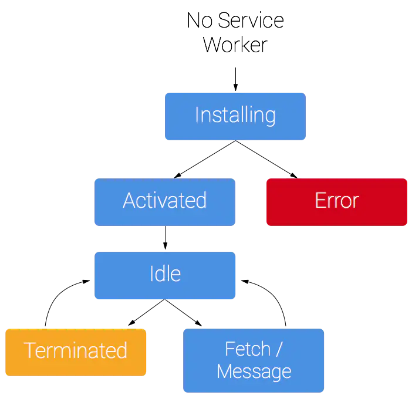

## service worker

## service worker 前言

1，如何降低一个页面的网络请求成本从而缩短页面加载资源的时间并降低用户可感知的延时是非常重要的一部分。对于提升应用的加载速度常用的手段有 `http cache`，

### service worker 的概念及用法

### service worker 生命周期

1，service worker 拥有一个完全独立于 Web 页面的生命周期。

